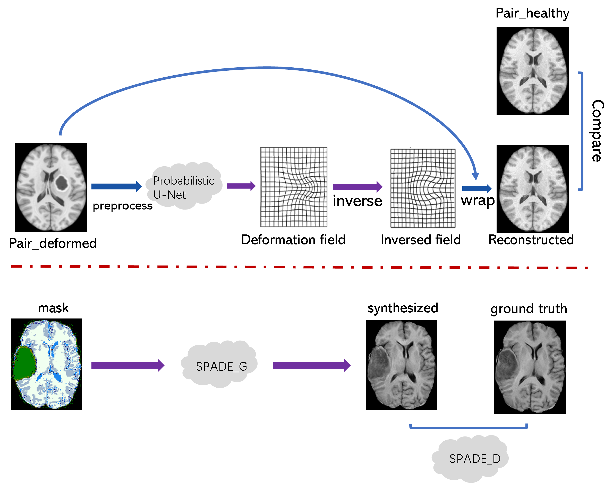
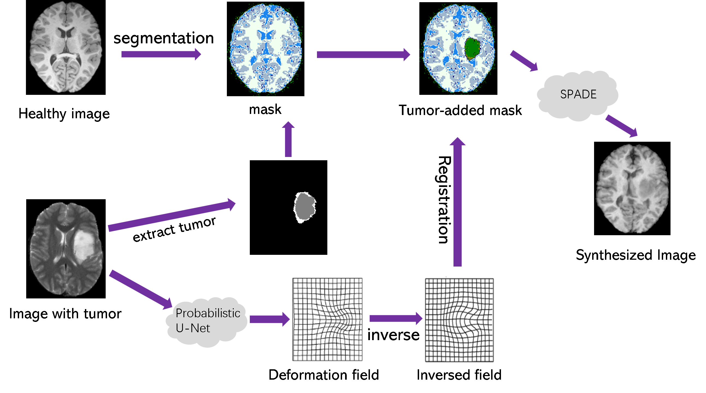

# Pediatric Tumor MRI Image Generation with Mass Effect
This is the official codebase for our SPIE 2023 [paper](https://www.spiedigitallibrary.org/conference-proceedings-of-spie/12464/2654366/Synthesis-of-pediatric-brain-tumor-images-with-mass-effect/10.1117/12.2654366.short?SSO=1): "Synthesis of Pediatric Brain Tumor Images With Mass Effect".
## Introduction
This repo contains the code to generate children's MRI images with tumor from healthy image. We consider the deformation of surrounding tissue induced by the tumor, which is called `mass effect`. \
The whole pipeline is illustrated as follows:
- Training:

- Inference:

## Mass effect prediction
The mass effect prediction method is proposed by .To use it, you should have segmented 

## Mask2Image algorithm
The domain adaptation method that we choose is `SPADE`, which is proposed by Nvlab in 2019. 
## Evaluation 
We synthesize 1260 new images.  3 different segmentation methods to 

## Acknowledgements
Our code borrows heavily from the following repos:  
[TumorMassEffect][TumorMassEffect]  
[SPADE][SPADE]  
[pytorch-fid][pytorch-fid]  
[Pytorch-Medical-Segmentation][Pytorch-Medical-Segmentation]

[TumorMassEffect]:https://github.com/hristina-uzunova/TumorMassEffect
[SPADE]:https://github.com/NVlabs/SPADE
[pytorch-fid]:https://github.com/mseitzer/pytorch-fid
[Pytorch-Medical-Segmentation]:https://github.com/MontaEllis/Pytorch-Medical-Segmentation

